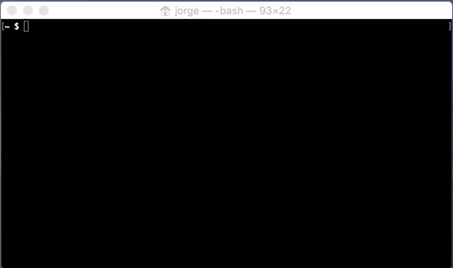

[](https://travis-ci.org/sitewhere/swctl) [](https://goreportcard.com/report/github.com/sitewhere/swctl) [](https://godoc.org/github.com/sitewhere/swctl) [](https://codecov.io/gh/sitewhere/swctl)


---

# SiteWhere Control CLI

## Build

For building it requires go 1.14+.

```console
make build
```

## Install swctl

### From source code

```console
make install
```

### Install binary with curl on Linux

```bash
curl -L https://github.com/sitewhere/swctl/releases/latest/download/swctl.linux.amd64 -o swctl && \
chmod +x ./swctl && sudo mv ./swctl /usr/local/bin/swctl
```

### Install binary with curl on macOS

```bash
curl -L https://github.com/sitewhere/swctl/releases/latest/download/swctl.darwin.amd64 -o swctl && \
chmod +x ./swctl && sudo mv ./swctl /usr/local/bin/swctl
```

### Install binary with curl on Windows

```bash
curl -L https://github.com/sitewhere/swctl/releases/latest/download/swctl.windows.amd64.exe -o swctl.exe
```

## Usage

### Install SiteWhere

To install SiteWhere 3.0 on your Kubernetes cluster, run the following command.

```console
swctl install
```

This comamnd will do the following for you:

- Create `sitewhere-system` Namespace.
- Install SiteWhere Custom Resource Definitions.
- Install SiteWhere Templates.
- Install SiteWhere Operator.
- Install SiteWhere Infrastructure.



### Listing SiteWhere Instances

```console
swctl instances
```

### Showing the details of a Intance

If you'd like to show the details `sitewhere` instance, execute this command:

```console
swctl instances sitewhere
```

The result should be something like this:

```bash
Instance Name                      : sitewhere
Instance Namespace                 : sitewhere
Configuration Template             : default
Dataset Template                   : default
Tenant Management Status           : Bootstrapped
User Management Status             : Bootstrapped
Configuration:
  Infrastructure:
    Namespace                      : sitewhere-system
    gRPC:
      Backoff Multiplier           : 1.50
      Initial Backoff (sec)        : 10
      Max Backoff (sec)            : 600
      Max Retry                    : 6
      Resolve FQDN                 : false
    Kafka:
      Hostname                     : sitewhere-kafka-kafka-bootstrap
      Port                         : 9092
      Def Topic Partitions         : 8
      Def Topic Replication Factor : 3
    Metrics:
      Enabled                      : true
      HTTP Port                    : 9090
    Redis:
      Hostname                     : sitewhere-infrastructure-redis-ha-announce
      Port                         : 26379
      Node Count                   : 3
      Master Group Name            : sitewhere
  Persistence:
    Cassandra:
    InfluxDB:
    RDB:
  Microservices:
      asset-management             : Ready
      batch-operations             : Ready
      command-delivery             : Ready
      device-management            : Ready
      device-registration          : Ready
      device-state                 : Ready
      event-management             : Ready
      event-sources                : Ready
      inbound-processing           : Ready
      instance-management          : Ready
      label-generation             : Ready
      outbound-connectors          : Ready
      schedule-management          : Ready
```

### Creating a SiteWhere Instance

```console
swctl create instance sitewhere
```

### Deleting a SiteWhere Instance

```console
swctl delete instance sitewhere
```
